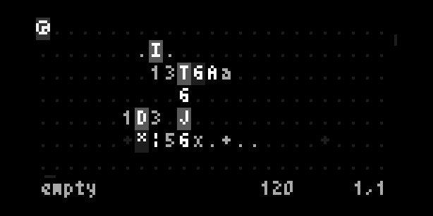
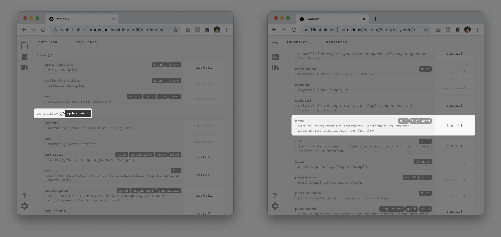
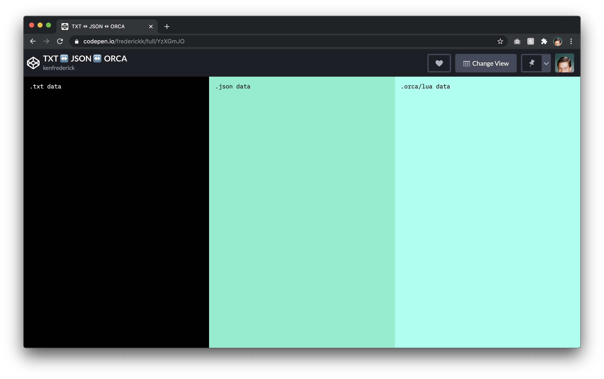

<!--  -->

## [Orca](https://100r.co/pages/orca.html) is a visual programming language, designed to create procedural sequencers on the fly.


```
............................
#.........█.................
#........█▒█......█.........
#.......█▒▒█.....█▒█........
#........██▒█....█▒█........
#.......██▒█▒█..█▒▒█........
#.......█▒▒██..█▒▒█.........
#........█▒██▒█▒▒█▒█........
#.........█▒▒▒▒████.........
#........█▒▒▒▒▒▒▒▒▒█........
#.......█▒▒▒▒█▒▒█▒▒▒█.......
#......█▒▒...▒▒▒▒..▒▒█......
#......█▒..█..▒▒..█..█......
#......█▒..█..▒▒..█..█......
#......█▒▒...▒██▒..▒▒█......
#.......█▒▒▒▒▒..▒▒▒▒█.......
#.........█▒▒▒▒▒▒▒▒█........
#........██▒..▒▒██..........
#.......██.█..▒██.██........
#..........█▒▒▒█............
#...........███.............
#.........░░█.█.............
#........░░░░▒█░............
#..........░░░░.............
............................
```

## Requirements

[Norns](https://monome.org/norns) or [Fates](https://llllllll.co/t/fates-a-diy-norns-dac-board-for-raspberry-pi/22999) or device.



Orca for Norns supports 4 different engines, but in order for them to work they must be installed.

- [FM7 engine](https://llllllll.co/t/fm7-norns/)
- [Passersby engine](https://llllllll.co/t/passersby/)
- [PolyPerc engine](https://llllllll.co/t/awake/)
- [Timber engine](https://llllllll.co/t/timber/)

---

## Install

Orca for Norns is available for install within [Maiden](http://norns.local/). Update the `Community` feed and then scroll down the list to Orca to `Install`.



If you're looking to develop checkout the documentation for [Contributing](#contributing).

- `<tab>` **Info bar**: Toggles info bar visibility
- `<esc>` **Unfocus**: Removes selection focus
- `<space>` **Play/Stop**: Toggles play state, stop kills all notes.
- `cmd/ctrl + >` **Adjust BPM**: Increments BPM + 10.
- `cmd/ctrl + <` **Adjust BPM**: Decrements BPM - 10.

---
## Documentation

Please refer to original [docs](https://github.com/hundredrabbits/Orca#operators) for general Orca operation.


### Operators

- `A` **add**(*a* b): Outputs sum of inputs.
- `B` **subtract**(*a* b): Outputs difference of inputs.
- `C` **clock**(*rate* mod): Outputs modulo of frame.
- `D` **delay**(*rate* mod): Bangs on modulo of frame.
- `E` **east**: Moves eastward, or bangs.
- `F` **if**(*a* b): Bangs if inputs are equal.
- `G` **generator**(*x* *y* *len*): Writes operands with offset.
- `H` **halt**: Halts southward operand.
- `I` **increment**(*step* mod): Increments southward operand.
- `J` **jumper**(*val*): Outputs northward operand.
- `K` **konkat**(*len*): Reads multiple variables.
- `L` **less**(*a* *b*): Outputs smallest of inputs.
- `M` **multiply**(*a* b): Outputs product of inputs.
- `N` **north**: Moves Northward, or bangs.
- `O` **read**(*x* *y* read): Reads operand with offset.
- `P` **push**(*len* *key* val): Writes eastward operand.
- `Q` **query**(*x* *y* *len*): Reads operands with offset.
- `R` **random**(*min* max): Outputs random value.
- `S` **south**: Moves southward, or bangs.
- `T` **track**(*key* *len* val): Reads eastward operand.
- `U` **uclid**(*step* max): Bangs on Euclidean rhythm.
- `V` **variable**(*write* read): Reads and writes variable.
- `W` **west**: Moves westward, or bangs.
- `X` **write**(*x* *y* val): Writes operand with offset.
- `Y` **jymper**(*val*): Outputs westward operand.
- `Z` **lerp**(*rate* target): Transitions operand to input.
- `*` **bang**: Bangs neighboring operands.
- `#` **comment**: Halts a line.

### IO / Norns

**Operators**

- `$` [**r.note**(scale-mode note)](#rnote): Outputs random note within scale.
- `?` [**levels**(*param* value)](#levels): Sets selected volume level on bang.
- `/` **softcut**(*playhead* *rec* *play* level rate position).
- `\` **softcut param**(*playhead* *param* value): Sets softcut param on bang.
- `|` [**synth**(*octave* *note*)](#synthengine): Plays a note with the synth engine.
- `-` [**synth param**(*param* *value*)](#synthparam): Sets synth param on bang.
- `:` **midi**(*channel* octave note velocity length): Sends a MIDI note.
- `%` **mono**(*channel* octave note velocity length): Sends monophonic MIDI note.
- `!` **cc**(*channel* knob value): Sends MIDI control change.
- `&` [**midi in**(*channel*)](#midi): Outputs received midi note.
- `^` [**cc in**(*cc*)](#midi): Outputs received midi cc value.
- `~` [**crow cv**(*channel* octave note attack release level)](#crow):
- `]` [**crow ii jf note**(octave note level)](#crow): Just Friends over i2c in voice mode.
- `}` [**crow ii jf voice**(*channel* octave note level)](#crow): Just Friends over i2c in note mode.
- `` ` `` [**crow w/syn**(octave note level)](#crow):
- `>` **g.write**(*x* *y* value): Sets grid led on bang.
- `<` **g.read**(*x* *y*): Reads specific coordinates. If value > 6 outputs bang.
- `(` **arc.read**(*enc*): Reads Arc encoder value
- `=` **OSC** (*path*;x;y..): Locks each consecutive eastwardly ports. `;` is delimeter for values.


**Keyboard Shortcuts**

| Controller     | Description     | Values    |
| -------------- | ----------------| --------- |
| `<tab>`        | Info bar        | Toggles info bar visibility |
| `<esc>`        | Unfocus         | Removes selection focus |
| `<space>`      | Play/Stop       | Toggles play state, stop kills all notes. |
| `cmd/ctrl + >` | Adjust BP       | Increments BPM + 10. |
| `cmd/ctrl + <` | Adjust BPM      | Decrements BPM - 10. |


**Key/Encoder**

| Controller   | Description       | Values    |
| ------------ | ----------------- | --------- |
| `K1 + E1`    | Select operator   | `A`–`Z`, `$`, `?`, `/`, `\`, `|`, `-`, `:`, `%`, `!`, `&`, `^`, `~`, `]`, `}`, `` ` ``, `>`, `<`, `=`, `*`, `#` |
| `K1 + E2`    | Select value      | `0`–`z`   |
| `K1 + E3`    | Select note       | `A`–`G`   |
| `K2`         | Clear character   |           |
| `K2`         | Toggle play/stop  |           |


---
### R.NOTE

The **R.NOTE** operator `$` takes 2 inputs(scale-mode, note).

This operator generates a scale based on the given mode (default is Dorian) and note/key (default is C). For example to generate an F natural minor scale enter `$2F`. There are 35 different modes to choose from:

- `1`: Major
- `2`: Natural Minor
- `3`: Harmonic Minor
- `4`: Melodic Minor
- `5`: Dorian
- `6`: Phrygian
- `7`: Lydian
- `8`: Mixolydian
- `9`: Locrian
- `a`: Gypsy Minor
- `b`: Whole Tone
- `c`: Major Pentatonic
- `d`: Minor Pentatonic
- `e`: Major Bebop
- `f`: Altered Scale
- `g`: Dorian Bebop
- `h`: Mixolydian Bebop
- `i`: Blues Scale
- `j`: Diminished Whole Half
- `k`: Diminished Half Whole
- `l`: Neapolitan Major
- `m`: Hungarian Major
- `n`: Harmonic Major
- `o`: Hungarian Minor
- `p`: Lydian Minor
- `q`: Neapolitan Minor
- `r`: Major Locrian
- `s`: Leading Whole Tone
- `t`: Six Tone Symmetrical
- `u`: Arabian
- `v`: Balinese
- `w`: Byzantine
- `x`: Hungarian Gypsy
- `y`: Persian
- `z`: East Indian Purvi


### LEVELS

The **LEVELS** operator `?` takes 2 inputs(*param*, value).

There are 9 different params that can be modulated on the fly with this operator:

- `1`: level output channels
- `2`: level engine master
- `3`: level softcut master
- `4`: level ADC input
- `5`: reverb engine level
- `6`: softcut reverb level
- `7`: reverb DAC level
- `8`: softcut ADC level
- `9`: softcut engine level

In order to trigger parameter setting a bang `*` has to occure on the left side of operator. The value is simply the percentage to set the level `0` is 0% `z` is 100%. For example `?5z` will set the engine reverb to 100%, or `?2h` will set the engine volume level to 50%.


### SYNTH/ENGINE

The **SYNTH** operator `|` inputs vary based on selected engine, but (*octave*, *note* ...) are always required (along with a bang) to produce sound.

There are 4 different engine supported by Orca [FM7](https://llllllll.co/t/fm7-norns/), [Passersby](https://llllllll.co/t/passersby/), [PolyPerc](https://llllllll.co/t/awake/), and [Timber](https://llllllll.co/t/timber/). Within the params menu engines can be changed. **Note: when changing engines you will have to reengage the clock by pressing K3**.


**FM7** is a "Polyphonic Synthesizer for Norns With 6 Operator Frequency Modulation". When this engine is selected, the **SYNTH** operator `|` takes up to 4 different inputs (*octave*, *note*, voice, amp). For example `|4C..` will play a C at the 4th octave (Midi scale).

- *octave*
  - values: `0`-`7`
- *note*
  - values: `A`–`G`
- voice
  - values `0`: 0s, `z`: 1.5s
- amp
  - values: `0`: 0.0, `z`: 1.0


**PASSERSBY** is a "West Coast style mono synth". When this engine is selected, the **SYNTH** operator `|` takes up to 6 different inputs (*octave*, *note*, velocity, timbre, pitchBend, pressure). For example `|4Cz...` will play a C at the 4th octave (Midi scale) with a velocity of 255.

- *octave*
  - values: `0`-`7`
- *note*
  - values: `A`–`G`
- velocity
  - values `0`: 0, `z`: 125
- timbre
  - values: `0`: 0.0, `z`: 1.0
- pitchBend
  - values: `0`: 0.0, `z`: 1.0
- pressure
  - values: `0`: 1.5, `z`: 3.0


**POLYPERC** is a "simple polyphonic filtered decaying square wave". When this engine is selected, the **SYNTH** operaptor `|` takes up to 2 inputs (*octave*, *note*). For example `|4C` will play a C at the 4th octave (Midi scale).

- *octave*
  - values: `0`-`7`
- *note*
  - values: `A`–`G`


**TIMBER** is a sample player engine and two scripts for norns. When this engine is selected, the **SYNTH** operator `|` takes up to 5 inputs (*octave* *note* *sample* level position). For example `|4C1` will play the first sample and tune it a C at the 4th octave (Midi scale).

- *octave*
  - values: `0`-`7`
- *note*
  - values: `A`–`G`
- *sample*
  - values: `0`: 0, `z`: 35
- level
  - values: `0`: 0.0, `z`: 1.0
- position
  - values: `0`: start of sample `z`: end of sample


### SYNTH PARAM

Each synth engine has numerous settings to modulate its sound profile. The **SYNTH PARAM** operator `-` are (*param* *value*) (except for `FM7` see below) these 2 params are always required (along with a bang) to modulate a given parameter.


**FM7**
When this engine is selected the **SYNTH PARAM** operator `-` takes up to 3 inputs (*param* *value* *voice*). This particular engine allows for a complex combination of params. For example `-5i1` sets the "Osc(illator) Amp(litude) Env(elope) Attack" to `5.14` seconds for voice `1`.  Load the included to `fm7-demo.orca` demo to see more params (be sure to select `FM7` within the params menu first).

- `1`: Osc Frequency Multiplier (Hz)
- `2`: Osc Phase (radians)
- `3`: Osc Amplitude (decibels)
- `4`: Carrier Amplitude (decibels)
- `5`: Osc Amp Env Attack (seconds)
- `6`: Osc Amp Env Decay (seconds)
- `7`: Osc Amp Env Sustain (decibels)
- `8`: Osc Amp Env Release (seconds)
- `9`: Osc1 Phase Mod Osc (decibels)
- `a`: Osc2 Phase Mod Osc (decibels)
- `b`: Osc3 Phase Mod Osc (decibels)
- `c`: Osc4 Phase Mod Osc (decibels)
- `d`: Osc5 Phase Mod Osc (decibels)
- `e`: Osc6 Phase Mod Osc (decibels)


**Passersby**
When this engine is selected the **SYNTH PARAM** operator `-` takes up to 2 inputs (*param* *value*). For example `-51` sets the "Envelope Type " to `"LPG"`. Load the included to `passersby-demo.orca` demo to see more params (be sure to select `Passersby` within the params menu first).

- `1`: Amp
- `2`: Attack (seconds)
- `3`: Decay (seconds)
- `4`: Drift
- `5`: Envelope Type
  - values `1`: LPG, `2`: Sustain
- `6`: FM Low Amount
- `7`: FM Low Ratio
- `8`: FM High Amount
- `9`: FM High Ratio
- `a`: Glide (seconds)
- `b`: LFO Frequency (Hz)
- `c`: LFO Shape
  - values `1`: Triangle, `2`: Ramp, `3`: Square, `4`: Random
- `d`: LFO > Attack
- `e`: LFO > Decay
- `f`: LFO > FM Low
- `g`: LFO > FM High
- `h`: LFO > Frequency (Hz)
- `i`: LFO > Peak
- `j`: LFO > Reverb Mix
- `k`: LFO > Wave Folds
- `l`: LFO > Wave Shape
- `m`: Peak (Hz)
- `n`: Pitch Bend All
- `o`: Pressure All
- `p`: Reverb Mix
- `q`: Timbre All
- `r`: Wave Folds
- `s`: Wave Shape


**PolyPerc**
When this engine is selected the **SYNTH PARAM** operator `-` takes up to 2 inputs (*param* *value*). For example `-3z` sets the "Release" to `3200ms`. Load the included to `polyperc-demo.orca` demo to see more params (be sure to select `PolyPerc` within the params menu first).

- `1`: Pulse width (%)
- `2`: Amp
- `3`: Release (seconds)
- `4`: Cutoff (Hz)
- `5`: Gain
- `6`: Pan
  - values: `0`: left, `i`: center, `z`: right

**Timber**
When this engine is seleted the **SYNTH PARAM** operator `-` takes up to 3 inputs (*param* *value* *sample*). For example `-811` sets the filter type to "high pass" for sample 1.

- `1`: Amp env attack
- `2`: Amp env decay
- `3`: Amp env sustain
- `4`: Amp env release
- `5`: Detune cents
- `6`: Stretch [percentage]
- `7`: Filter freq
- `8`: Filter resonance
- `9`: Filter type
  - values: `0`: Low Pass, `1`: High Pass
- `a`: Quality
  - values: `0`: Nasty, `1`: Low, `2`: Medium, `3`: High
- `b`: Freq mod LFO 1
- `c`: Freq mod LFO 2
- `d`: Filter freq mod LFO 1
- `e`: Filter freq mod LFO 2
- `f`: Pan mod LFO 1
- `g`: Pan mod LFO 2
- `h`: Amp mod LFO 1
- `i`: Amp mod LFO 2
- `j`: Freq mod envelope
- `k`: Filter freq mod envelope
- `l`: Filter freq mod velocity
- `m`: Filter freq mod pressure
- `n`: Filter tracking
- `o`: Pan mod envelope
- `p`: Envelope attack
- `q`: Envelope decay
- `r`: Envelope sustain
- `s`: Transpose
- `t`: Stretch [length]
- `u`: Stretch [bars]
  - values: `0`: 1/64, `1`: 1/48, `2`: 1/32, `3`: 1/24, `4`: 1/16,`5`: 1/12,`6`: 1/8,`7`: 1/6,`8`: 1/4,`9`: 1/3,`a`: 1/2,`b`: 2/3,`c`: 3/4,`d`: 1 bar
- `v`: Pan
  - values: `0`: left, `i`: center, `z`: right
- `w`: Amp
- `x`: Envelope release
- `y`: Start frame
- `z`: End frame


### MIDI

The **MIDI IN** operator `&` takes 1 input(channel).

This operator receives a MIDI note from a MIDI controller, based on the channel value (default is channel 1).


The **CC IN** operator `^` takes 1 input(channel).

This operator receives a MIDI CC message from a MIDI controller, based on the channel value (default is channel 1).


### CROW

The **CROW CV** operator `~` takes up to 6 parameters (*channel* octave note attack release level).

- *channel*
  - values: `0`: crow out 1 is 1v/Oct CV and out 2 is an AR envelope; `1`: crow out 3 is 1v/Oct CV and out 2 is AR envelope.
- octave
  - values: `0`-`7`
- note
  - values: `A`–`G`
- attack
  - values `0`: 0s, `z`: 1.5s
- release
  - values: `0`: 0s, `z`: 3s
- level
  - values: `0`: 0V, `z`: 10V

For example `~04Chhz` sets channel to value `0`, plays a `C4` note with a 750ms attack, 750ms release, at 10V.

The **CROW JF II** operator `]` takes up to 4 parameters (*channel* octave note level). For this operator, *channel* can be set 0-5 and sets which channel the voice is playing from.


---
## Tutorials and Demos

When Orca is installed, a number of tutorials ([original](https://git.sr.ht/~rabbits/orca-examples/tree/master/)) and demos are available to demonstrate basic and Norns specific functionalites.

- [Engines](./tutorials/README.md#engines)
- [Basics](./tutorials/README.md#basics)
- [Logic](./tutorials/README.md#logic)
- [Projectors](./tutorials/README.md#projectors)
- [Variables](./tutorials/README.md#variables)


---
## Import/Export

This Norns port of Orca is capable of loading and exporting Orca `.txt` files. The creates interoperability for repositories such as [Patchstorage](https://patchstorage.com/platform/orca/).

**Note change the file extension for files downloaded from Patchstorage to `.txt`**. Upload the file to your Norns using [SSH](https://monome.org/docs/norns/maiden/#ssh) or FTP and use "`> Load project`" in the params menu to load a `.txt` file.

Conversely, you can also use this [online coverter](https://codepen.io/frederickk/full/YzXGmJO) for either `.txt` files or even copying from other Orca's such as the [web version](https://hundredrabbits.github.io/Orca/). This converter will import/export `.txt`, `.json`. or `.orca` (Norns) filetypes, which can then be uploaded to your Norns via [SSH](https://monome.org/docs/norns/maiden/#ssh)/FTP.



Cut and paste the following into the [online coverter](https://codepen.io/frederickk/full/YzXGmJO) to see how it works.

```
..Cc............
..3B6...........
...3A1..........
.R..4.O#AMAZING#
.tYt4XZ.........
```

Here's how you could upload a file via `sftp` — such as an exported `.orca` file — to Norns (replace `<filename>` with name of your file).

```bash
$ sftp we@norns.local
$ put ./<filename>.orca /home/we/dust/data/orca/<filename>.orca
```

---
## Contributing

If you're a developer interested in contributing features or fixes, checkout the [contributing](./CONTRIBUTING.md) documentation.

There are 2 main branches used for maintaining quality of experieece.

- [Primary](https://github.com/frederickk/orca/tree/primary) is the stable branch and also the branch thatis pulled in by users through [Maiden](https://monome.org/docs/norns/maiden/).
- [Dev](https://github.com/frederickk/orca/tree/dev) is the "bleeding edge" branch and should only be used by those that are helping debug, contributing, or those that like to live dangerously.
