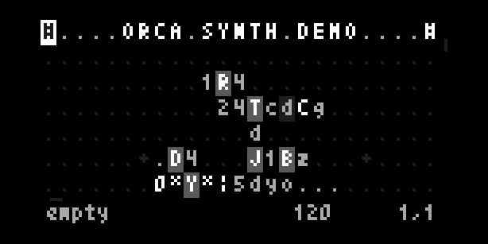
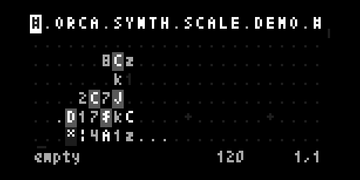
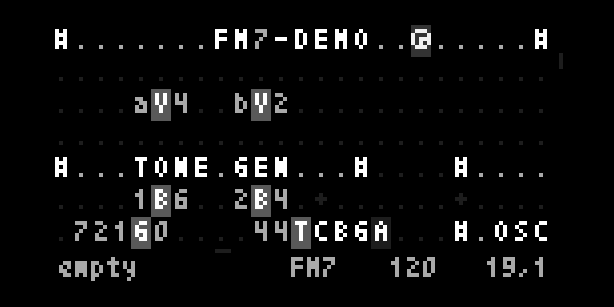
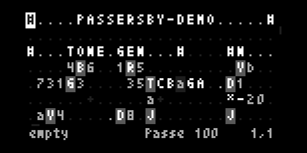
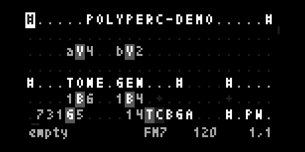
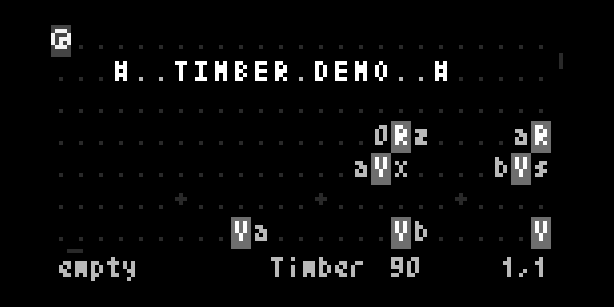
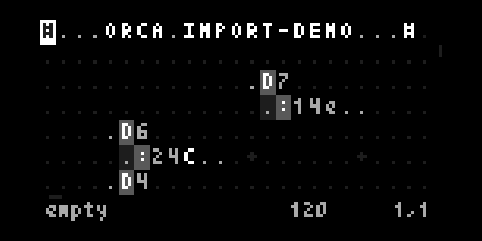

# Tutorials and Demos

- [Engines](#engines)
- [Basics](#basics)
- [Logic](#logic)
- [Projectors](#projectors)
- [Variables](#variables)

---
## Engines

For the Norns version of Orac different synth engines available to choose from. Synth engines on Norns use the same operators `|` for playing a note with the synth and `-` for setting a synth's params. The following demos are designed to show-off functionality and capability of each engine.

### [synth-demo](./engines/synth-demo.orca)



This demo shows very simply how the **SYNTH** operator `|` works for any of the engines, by randomly selecing notes created with the **TRACK** `T` operator.


### [synth-scale-demo](./engines/synth-scale-demo.orca)



This demo shows very simply how the **R.NOTE** operator `$` works, using the **SYNTH** `|` operator to generate the tones using any of the engines.


### [fm7-demo](./engines/fm7-demo.orca)



This demo shows the FM7 engine (be sure the FM7 engine is installed and loaded) works using the **SYNTH** `|` operator and how its sound profile can be adjusted with the **SYNTH PARAMS** `-` operator.


### [passersby-demo](./engines/passersby-demo.orca)



This demo shows the Passersby engine (be sure the Passersby engine is installed and loaded) works using the **SYNTH** `|` operator and how its sound profile can be adjusted with the **SYNTH PARAMS** `-` operator.


### [polyperc-demo](./engines/polyperc-demo.orca)



This demo shows the PolyPerc engine (be sure the PolyPerc engine is installed and loaded) works using the **SYNTH** `|` operator and how its sound profile can be adjusted with the **SYNTH PARAMS** `-` operator.


### [timber-demo]()



This demo shows the Timber (be sure the Timber engine is installed and loaded) works using the **SYNTH** `|` operator and how the samples can be manipulated with the **SYNTH PARAMS** `-` operator.


### [txt-import-demo](./misc/txt-import-demo.txt)



This is a text file, similar to what can be found on [PatchStorage](https://patchstorage.com/platform/orca/). Load this demo with the "`» Import txt`" menu within the main parameters page. Note, this demo uses the MIDI operator `:`, so unless you have a MIDI controller attached you won't hear any sound.

---
## Basics

Orca operates on a base of 36 increments, operators will convert alphanumeric values into values ranging from 0 to 36. Special characters are used to handle platform and client specific interactions.

This section will teach the basics of playing a note and a sequence of notes.

### Send a midi note

- `D8`, will send a bang, every `8th` frame.
- `:03C`, will send the `C` note, on the 3rd octave, to send `C#`, use the lowercase `c3`.

```
D8...
.:03C
```

### Play a random note

- `aRG`, will output a random value between A & G, the rightside uppercase letter indicates an uppercase output.

```
D8.aRG.
.:03D..
```

### Make a melody

- `04TCAFE`, will create a track of 4 notes, and output its first value.

```
D814TCAFE
.:03A....
```
### Play the melody

- `8C4`, will count from 0 to 3, at `1/8th` speed.

```
.8C4.....
D804TCAFE
.:03C....
```

--
## Logic

This section will teach the basics of automating logic decisions and changing the values of operators dynamically.

### Play every second note

- `2I6`, will increment to 6 at a rate of 2.

```
.2I6.......
D626TCAFEDG
.:03F......
```

### Play a note with an offset

- `1AC`, will add 1 to C, to output D. To get D#, use the lowercase d, like `1Ac`.

```
D8.1AC.
.:03D..
```
### Play a sequence back and forth

- The combination of the output of `C6` into `B3` will bounce a value between 0 and 3 over 6 frames.

```
4C6......
.4B3.....
D414TCAFE
.:03A....
```
### Play a note at a specific interval

- `.I4`, will increment to 4, at a rate of 1.
- `.F2`, will bang only if leftside input is equal to 2.

```
I4.....
3F2.1AC
..:03D.
```

---
## Projectors

This section will teach the basics of creating new operators procedurally.
Halt a moving operator

- `E`, will travel further eastward, every frame.
- `H`, will stop a E from moving.

```
..H
E..
```

### Read an operator at position

- `22O`, will get the operator E at the offset 2,2.

```
22O...
..E..H
.....E
```

### Write an operator at position

- `22X`, will output the operator E at the offset 2,2.

```
22XE.
.....
.....
....E
```

### Animate a projector

- `B4`, will bounce from 0 to 4 and back.

```
C...........
.B4.........
.1XE........
........:03C
........:03D
........:03E
........:03F
........:03G
```

---
## Variables

This section will teach the basics of storing accessing and combining that stored data.

### Write a variable

- aV5, will store 5 in the variable a.

```
aV5
```

### Read a variable

- Va, will output the value of the variable a. Notice how variables always have to be written above where they are read.

```
.....Va
.......
aV5..Va
.....5.
.......
aV6..Va
.....6.
```

### Read 3 variables

- 3Kion, will output the values of i, o & n, side-by-side.

```
iV0.oV3.nVC
...........
3Kion......
.:03C......
```

### Carry a value horizontally and vertically

- Y, will output the west input, eastward.
- J, will output the north input, southward.

```
3..
J..
3Y3
```

### Carry a bang

- This method will allow you to bring bangs into tight spots.

```
D43Ka...
.Y.:03C...
```
